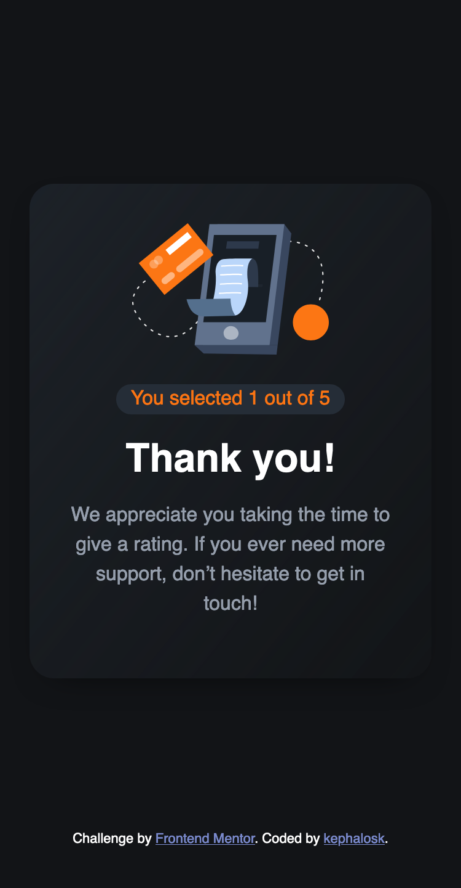

# Frontend Mentor - Social links profile solution

This is a solution to the [Blog preview card challenge on Frontend Mentor](https://www.frontendmentor.io/challenges/blog-preview-card-ckPaj01IcS/hub). Frontend Mentor challenges help you improve your coding skills by building realistic projects. 

## Table of contents

- [Overview](#overview)
  - [Screenshot](#screenshot)
  - [Links](#links)
- [My process](#my-process)
  - [Built with](#built-with)
  - [What I learned](#what-i-learned)
  - [Continued development](#continued-development)
  - [Useful resources](#useful-resources)
- [Author](#author)
- [Acknowledgments](#acknowledgments)


## Overview

### Screenshot

Desktop


Desktop


Mobile


Mobile


Active1


Active2


Active3


### Links

- Solution URL: [Add solution URL here](https://github.com/kephalosk/interactive-rating-component)
- Live Site URL: [Add live site URL here](https://kephalosk.github.io/interactive-rating-component/)

## My process

1. download Project


2. move Project to target folder


3. open Project in IDE


4. read README


5. add .gitignore-file


6. check files


7. check design


8. initialize repo
* create repo on GitHub
* git init
* git add .
* git commit -m "initial commit"
* git remote add origin git@github.com:kephalosk/${projectname}.git
* git push -u origin master

9. check html
* build general structure
* open index.html in browser for comparison

10. check css
* image styling
* font styling
* color styling
* frame styling
* spacing styling

11. check transitions


12. check mobile/responsive design


13. check accessability
* semantic html
* headings
* alternative texts
* language
* clear language
* link texts

14. extract css


15. add screenshots


16. update README


17. publish website

### Built with

- Semantic HTML5 markup
- CSS custom properties
- Desktop-first workflow

### What I learned

I learned to remove the outline from keyboard focused elements:
```css
button:focus {
background-color: hsl(0, 0%, 100%);
outline: none;
}
```

I learned to write my own event listeners:
```javascript
const button = document.querySelector('button');
button.addEventListener('click', showResult);
button.addEventListener('keydown', function(event) {
  if (event.key === 'Enter' || event.key === ' '){
    showResult.call(this);
    event.preventDefault();
  }
});
```

I learned that setting styles directly in javascript counts as inline-styling. 
So it overwrites css styling

I learned to read and write text content of html elements with javascript

I learned to remove focus from a selected html element with this.blur();

I improved html, css and javascript skills in general.

### Continued development

* improve html
* improve css

### Useful resources

- [w3schools](https://www.w3schools.com/) - HTML and CSS knowledge
- [selfhtml](https://wiki.selfhtml.org/wiki/HTML) - HTML knowledge

## Author

- Website - [kephalosk](https://easywebpath.com)
- Frontend Mentor - [@yourusername](https://www.frontendmentor.io/profile/yourusername)
- Twitter - [@yourusername](https://www.twitter.com/yourusername)

## Acknowledgments

None.